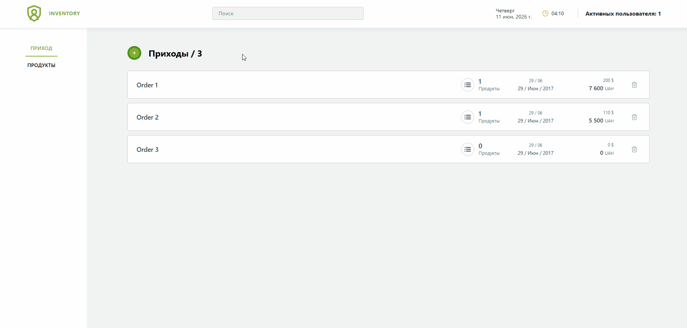
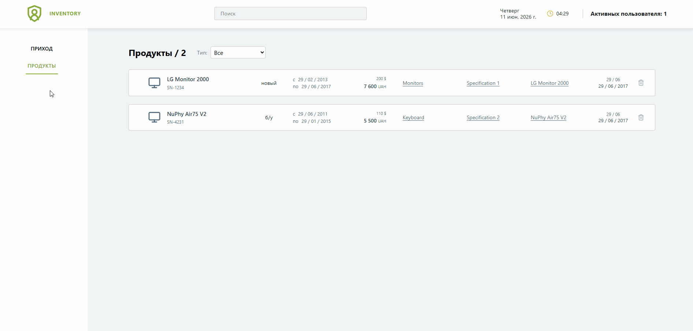

# 📦 StockFlow SPA

> A minimalist single-page application (SPA) for inventory management.

<details>
  <summary><b>🎬 View a demo (GIF)</b></summary>
  <br>
  
  <br><br>
  
</details>

---

<table>
    <td>
      <h3> Tech Stack</h3>
      <ul>
        <li><b>Frontend:</b> React 19, Redux Toolkit, React Router, Vite</li>
        <li><b>Backend:</b> Node.js 22, Express</li>
        <li><b>UI Framework:</b> Bootstrap & React-Bootstrap</li>
        <li><b>Networking:</b> Axios & Socket.io</li>
        <li><b>Infrastructure:</b> Docker</li>
      </ul>

<h3>Implemented Features</h3>
<ul>
  <li><b>State Management:</b> Redux Toolkit global store.</li>
  <li><b>Inventory Management:</b> CRUD operations for products and orders.</li>
  <li><b>Real-time Analytics:</b> Live session counter via WebSockets.</li>
</ul>
</td>
</table>

---

# 🛠️ Installation

### 1: Docker (Recommended)

```bash
# Clone the repository
git clone https://github.com/Dezmond152/stockflow-spa.git

# Enter project directory
cd stockflow-spa

# Build and start all services
docker compose up
```

Accessible at: http://localhost:5173

---

### 2: Manual Local Setup (Node.js locally)

```bash
# Clone and enter the project
git clone https://github.com/Dezmond152/stockflow-spa.git
cd stockflow-spa

# Run Backend
cd backend
npm install
npm start

# Run Frontend (New terminal tab)
cd ../frontend
npm install
npm run dev
```

---

## Roadmap

- Full codebase migration to TypeScript.
